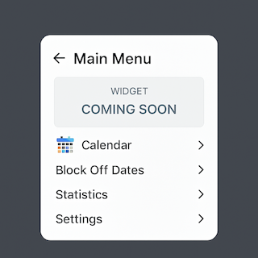
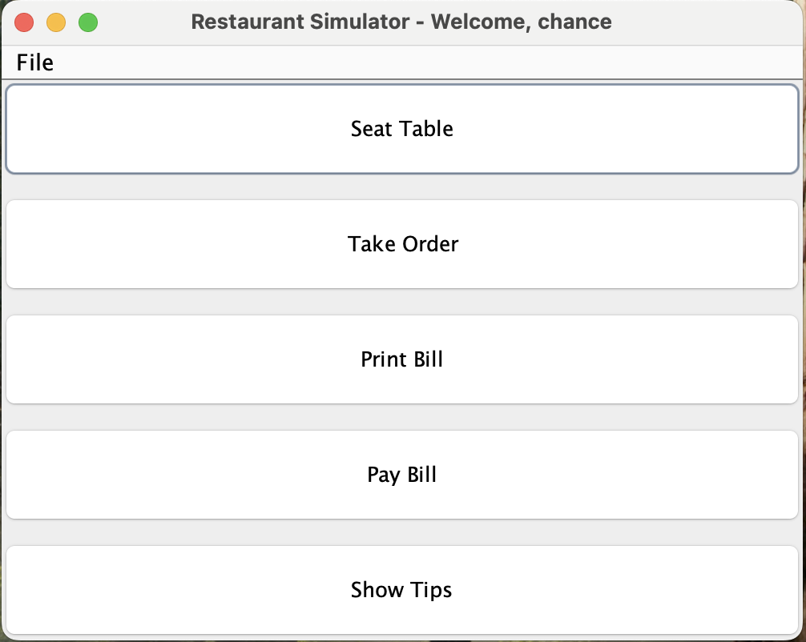

# Aspiring Software Engineer

#### Technical Skills: Java, C, Python, SQL, Javascript, MIPS Assembly, HTML, Unix

#### Technologies and Tools: VS Code, Eclipse, MARS, JUNIT, Git/GitHub, MySQL, Pandas, Plotly

## About Me

Hey, I’m Chance Krueger. I grew up in San Diego and now live in Tucson, where I’m studying Computer Science at the University of Arizona with a Business Administration minor.

I'm passionate about software development—especially backend systems—and aim to build a career as a software developer. I’m also exploring DevOps and cybersecurity on the side to stay well-rounded in tech. I currently hold certifications in "Querying Data" (Intel) and "Python and Data" (Recording Academy), and I’m actively working on more certifications and personal projects to deepen my skills and keep learning.

Outside of coding, I played baseball and golf most of my life, and I’m a big fan of college basketball and football. I enjoy being part of driven teams and am always looking for new opportunities to grow, contribute, and build impactful systems. 

[Link to Resume](images/Internship Resume 2025 with Certifications.pdf)

## Certifications

PHOTO

### Querying Data (Intel)

Using SQL to pull data from large datasets with Intel

PHOTO

### Python and Data (Recording Academy)

Using Python to analyze data with Recording Academy (Grammy Awards)

## Education 

### University of Arizona | Tucson, Arizona | Bachelor of Arts in Computer Science | Minor in Business Administration | Expected Graduation: May 2026

#### Academic Achievements: Dean's List with Distinctions (2x) | Academic Year/Academic Distinction | Deans’List

#### Concentrations:  Software engineering/development, structured programming techniques, hands-on coding and testing, scalable system design, and collaborative problem-solving in innovative technologies.

#### Related Coursework: Computing in Python, Software Development in Java, Computer Organization and MIPS, Object-Ornt Programming+Design, System Programming+Unix, Analysis of Discrete Structures, Data Wrangling with SQL, Discrete Mathematics

## Work Experience 

**Course Coordinator / Undergraduate Teaching Assistant in Java/Python (_August 2024 – Present_)**
University of Arizona, Computer Science Department
- Provide in-class technical support and facilitate student engagement during lectures and labs.
- Host office hours to assist with programming, debugging, and conceptual understanding.
- Grade and correct assignments/exams; assist in creating instructional materials.
- Coordinate TA meetings, organize grading workflows, and maintain consistency across sections.
- Act as a liaison between instructors and TAs; support course logistics and documentation.
- Mentor new UGTAs and contribute to onboarding and team support.
- Courses Taught: Object Oriented Programming+Design (Java), Intro to Computer Science (Java), Python Programming.

**Coding for Data (Python for Data) (_July 2025 - August 2025_)**
The Global Career Accelerator
- Completed an advanced, project-based Python bootcamp focused on real-world data analytics and business problem-solving.
- Leveraged deep Python skills to tackle complex projects involving data cleaning, filtering, aggregation, and visualization using Pandas and Plotly.
- Analyzed diverse datasets from companies such as ASOS, DoorDash, Lyft, and Spotify.
- Developed a portfolio project analyzing website performance data for The Grammy Awards, simulating real industry scenarios.
- Completed training on cross-cultural communication, bias management, and career readiness skills.

**Coding for Data (Data Wrangling with SQL) (_May 2025 - July 2025_)**
The Global Career Accelerator
- Participated in an intensive, project-based SQL bootcamp focused on real-world data analysis and data wrangling.
- Applied SQL to clean, query, and join datasets from platforms like YouTube, DoorDash, Zillow, and Uber.
- Attended live lab sessions with instructors to reinforce concepts and debug queries in real time.
- Developed a portfolio project analyzing sustainability data for Intel, simulating real industry use cases.
- Completed training in cross-cultural communication and building a professional online presence.

## Projects
### Auto-Planner-Scheduler

[Link to Auto-Planner-Scheduler](https://github.com/Chance-Krueger/Auto-Planner-Scheduler)

A future GUI-based application (with planned design and JAR file) that will function as both a calendar and scheduler. It will automatically allocate time for events you input, helping you manage your schedule more efficiently and stay organized. The application will use custom algorithms—rather than AI—to determine the most efficient and effective schedule. It will dynamically update your schedule based on new inputs or changes, ensuring it stays optimized. More features and enhancements are planned for future updates.

### Server-POS-GUI

[Link to Server-POS-GUI](https://github.com/Chance-Krueger/Server-POS-GUI)

This Java GUI application simulates a restaurant server's tasks. Run LoginFrame to start. Users can log in or create an account to seat tables, take orders, print/pay bills, and view tips. A special manager login (management / Manager!123) provides access to sales data and item statistics. The project follows the Model-View-Controller (MVC) design and makes use of HashMaps, enums, and encapsulation best practices.

## My GitHub

#### [Link To My GitHub](https://github.com/Chance-Krueger)

#### [Link To My Repositories](https://github.com/Chance-Krueger?tab=repositories)

#### [Link to My Listed/Sorted Repositories](https://github.com/Chance-Krueger?tab=stars)

## My LinkedIn

#### [Link to My LinkedIn](https://www.linkedin.com/in/chance-krueger)

